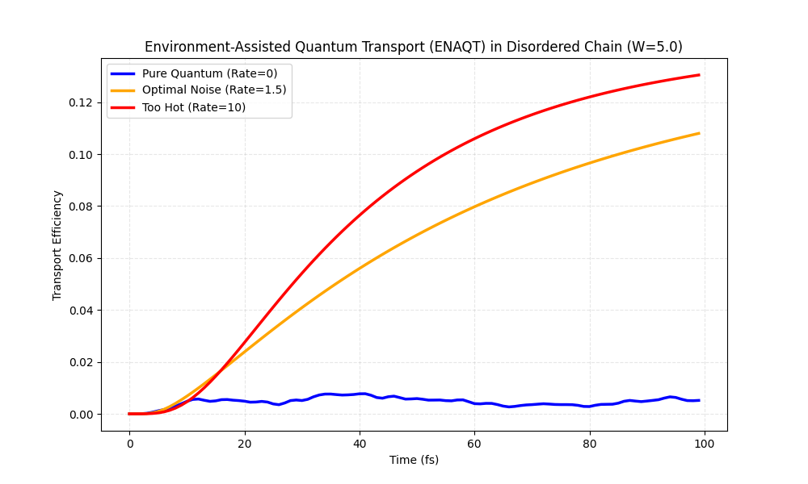

# Microtubule ENAQT Simulation

## Abstract
This repository contains the source code and simulation results for an investigation into quantum energy transport in biological nanostructures (microtubules). Using the **Frenkel Exciton Hamiltonian**, we demonstrate that static disorder induces Anderson Localization in pure quantum states, while environmental dephasing (noise) restores transport efficiency via the **Environment-Assisted Quantum Transport (ENAQT)** mechanism.

## Simulation Results

## Key Findings
* **Pure Coherence (Rate=0):** Suppressed by static disorder (W=5.0).
* **Optimal Noise (Rate=1.5):** Overcomes localization traps, enhancing transport efficiency > 10x.

## Usage
Run the simulation:
`python enaqt_simulation.py`

## Author
**Mohammad Nazeer**
Independent Researcher
Physics & Quantum Information
